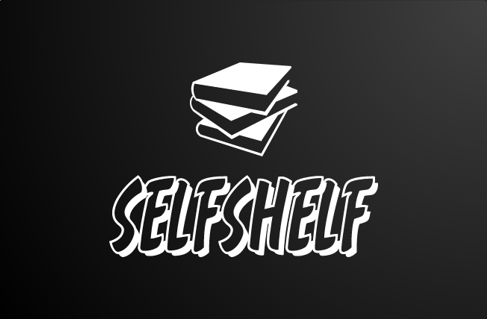

# Welcome to selfshelf

## Selfshelf is an online Library / shelf.

It is pretty much a library where you store books, only that it is online.

It has multiple categories / genres for you to arrrange your book, 
and you can also add as many more categories as you would like.

You can add as many books as you would like and arrange them as you see fit.

## You can 

- **Add a cover image for the book,**

- **Add a link to an online copy of the book,**

- **Add a pdf version of the book**

And many more.

If you provided a pdf version of the book while adding the book, you will be able to download a copy at any time.

## Privacy

Your shelf is private and online through your account can you access your books.

It is free to use, and you can create an account in a minute, using email, or your Google account

## You can check it out [here] (https://selfshelf.onrender.com)
